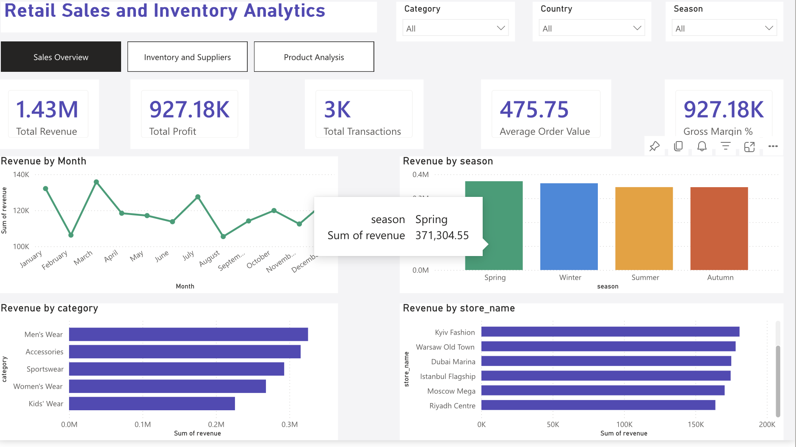
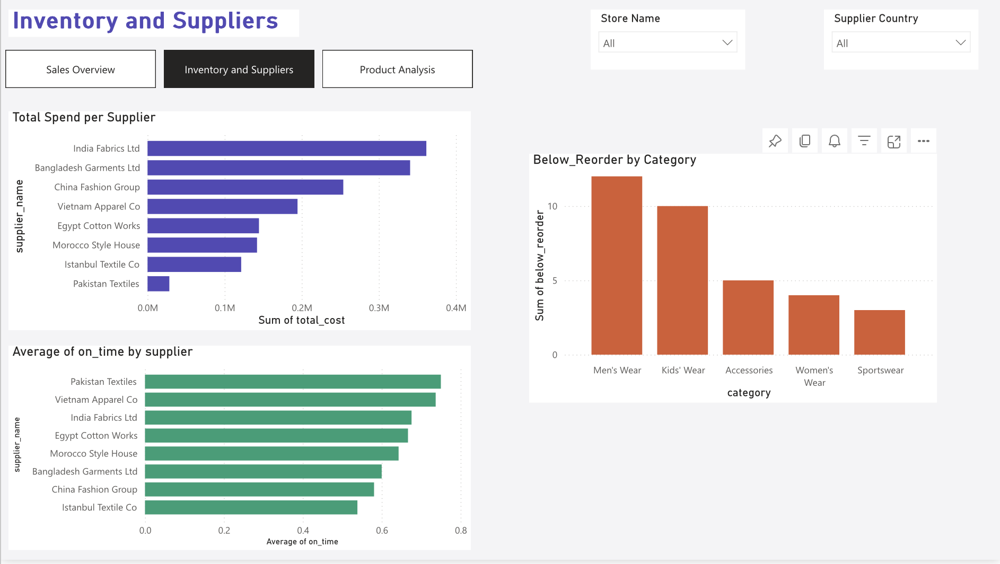
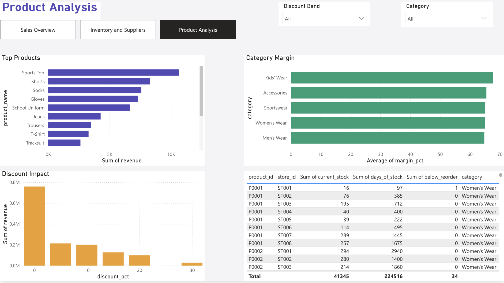

# Retail Sales & Inventory Analytics

End-to-end retail analytics project simulating sales performance, inventory management, supplier KPI tracking, and demand forecasting for a multi-store fashion retailer.

Built to demonstrate skills in SQL, Python (Pandas), and Microsoft Power BI — inspired by real procurement and supply chain analysis work at a global fashion retailer.

---

## Live Power BI Dashboard

[View Interactive Dashboard on Power BI Service](https://app.powerbi.com/groups/71156bbb-2668-49ad-a42e-a4db44ec0e98/reports/99bf88c7-f6e4-4dd5-848d-8236e49ffb10?ctid=66e44254-c0ce-4745-9255-907eee03faf6&pbi_source=linkShare)
---

## Dashboard Preview

### Page 1 — Sales Overview

### Page 2 — Inventory & Suppliers

### Page 3 — Product Analysis

---

## Project Overview

This project replicates the type of analytical work performed as a Procurement Analyst at a high-volume fashion retail operation — analysing sales trends, optimising inventory levels, evaluating supplier performance, and supporting purchasing decisions with data-driven insights.

The dataset is synthetic but realistic, comprising 8 stores across 7 countries, 8 suppliers across 6 sourcing markets, 33 products across 5 categories, and 3,000 sales transactions across a full retail year.

---

## Key Metrics

| Metric | Value |
|---|---|
| Total Revenue | $1.43M |
| Total Profit | $927K |
| Gross Margin | 65.0% |
| Stores | 8 across 7 countries |
| Suppliers | 8 across 6 markets |
| Products | 33 across 5 categories |
| Period | Aug 2021 – Jul 2022 |

---

## Analysis Included

**SQL**
- Sales KPI overview — revenue, profit, margin, avg order value
- Revenue by product category with contribution %
- Store performance including revenue per sqm
- Monthly and seasonal sales trends
- Top 10 products by revenue
- Supplier performance — spend, lead time, on-time delivery
- Inventory health check — items below reorder point
- Discount impact analysis by discount band
- Demand forecasting base using LAG window functions
- Data quality checks

**Power BI Dashboard**
- 3 report pages with full interactivity
- Page navigation buttons
- Slicers for season, category, country, discount band
- KPI cards with dynamic values
- Monthly revenue trend
- Revenue by category, season, store
- Supplier spend vs on-time delivery
- Inventory health by category
- Top products and discount impact analysis

---

## Tools Used

| Tool | Purpose |
|---|---|
| Python (Pandas, NumPy) | Dataset generation and analysis |
| SQL (PostgreSQL syntax) | Data querying and transformation |
| Microsoft Power BI Service | Interactive dashboard delivery |
| DAX | KPI measures and calculated columns |
| Git / GitHub | Version control and portfolio |

---

## How to Run SQL Analysis

Load all CSV files into any SQL database (PostgreSQL, SQLite, or SQL Server) and run retail_analysis.sql.

    Files needed:
    sales.csv
    products.csv
    stores.csv
    suppliers.csv
    inventory.csv
    purchase_orders.csv

---

## Key Insights

1. Women's Wear is the top-performing category driving the largest share of revenue
2. Istanbul Flagship and Dubai Marina are the highest revenue stores
3. Summer season generates peak revenue driven by seasonal demand
4. Approximately 65% average gross margin maintained across all categories
5. Morocco Style House and Istanbul Textile Co deliver the best on-time performance
6. Several product-store combinations are below reorder point — immediate replenishment required

---

## About

**Oguz Tuncel** — Data Analyst | Continuous Improvement | Power BI Developer

- LinkedIn: https://linkedin.com/in/oguztuncel
- Email: ogzhantuncell@gmail.com
- Melbourne, VIC, Australia

---

*This project uses synthetic data generated for portfolio purposes. No real commercial data is included.*
